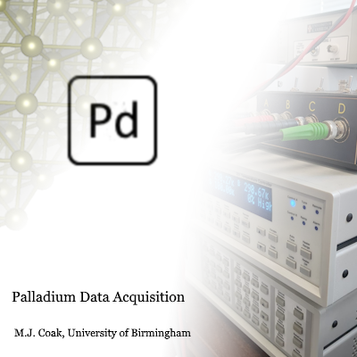

<!--
Source for the toolbox's Getting Started guide, shown from the Add-Ons manager.
The build (buildtool gettingStarted, run as part of doc and package) converts it
with Tools/BuildGettingStarted.m into GettingStarted.m, a plain-text live script.
That file is generated, so edit this one. It is not a DocMaker page: the doc task
skips it, and it is not packaged.

As well as standard Markdown:
  {{version}}       is replaced with the version from Palladium.ver()
        embeds an image (path relative to this file), with an
                    optional {width=N} straight after it
  {align=center}    at the end of a line centres it
  ```matlab blocks  become runnable code
  ---               starts a new live script section
-->

# Palladium Data Acquisition {align=center}

*Version {{version}}* {align=center}

{width=300} {align=center}

## Getting started

Palladium DAQ is a modular framework for laboratory data acquisition: instrument
control, data logging and real-time graphing. It includes a library of Instruments
(drivers) for common lab hardware - multimeters, source meters, lock-ins, temperature
controllers, magnet power supplies and more - and adding new ones from the provided
template is straightforward. A default GUI is included, but it can be swapped for
another, or Palladium DAQ can run with no GUI at all.

**[Open the Palladium DAQ documentation](matlab:web(fullfile(fileparts(which("Palladium")),"Docs","index.html")))** - user guide and API reference.

## Features

- **Instruments** - a built-in suite of instrument drivers, easy to extend with new MATLAB or Python classes based on the templates provided
- **Real-time plotting** of all acquired data
- **Instrument Controls** - logic and GUI elements for sweeps, scans, heater and magnet control, and other complex measurements
- **Presets** - .json files describing commonly used hardware setups and settings, to skip repetitive setup on startup
- **Data Viewer** - a built-in programme for viewing and comparing saved data files
- **Sequence Editor** - scripts of commands for autonomous measurement runs

---

## Quick start

Run this section to launch Palladium DAQ with its default GUI, and add a simulated
Keithley 2000 multimeter (`ConnectionType="Debug"` needs no hardware). Then press
**Start** in the GUI to begin taking readings.

```matlab
pd = Palladium();
pd.AddInstrument("Keithley2000", ConnectionType="Debug");
```

Palladium DAQ can also be launched by typing `Palladium` in the Command Window, or
with a Preset: `Palladium(Preset="Example")`.

---

## Requirements

MATLAB R2026b or later, with the Instrument Control Toolbox.

{width=24} [Palladium DAQ on GitHub](https://github.com/MattCoak-Research/PalladiumDAQ) - M.J. Coak, University of Birmingham
