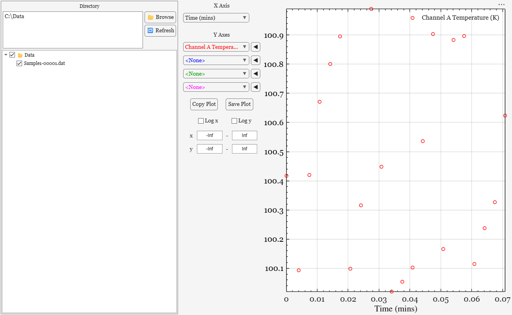

# Data files

While measurements are running, Palladium DAQ writes a data file: a header describing the measurement, then one line of readings per measurement tick. Each line is written as soon as it is measured, so the file is always up to date - even if MATLAB closes unexpectedly.

## File format

Data files are tab-separated text with the extension `.dat` (set by `DataFileExtension` in [Config.json](presets-and-config.md)), so they can be opened in any text editor or spreadsheet. A file looks like this:

```text
<<< Palladium DAQ data file 3.0 >>>
Sample 1, after annealing, 2 K base temperature

<Instrument Settings and Metadata>
K2000_1 Settings: MeasurementMode = Resistance || Units = Ohms || Range = 1000 || AutoRange = false || NPLC = 1
<<< END METADATA LINES >>>

Time (mins)	Channel A Temperature (K)	Channel B Temperature (K)	Ls331_1 Heater Power (W)	K2000_1 - Resistance_Ohms
29545432.2083213	100.814723686393	100.905791937076	0.452857203366604	17.0213
29545432.2142851	100.913375856139	100.632359246225	0.452194659112487	16.9874
```

In order:

1. **Format line** - `<<< Palladium DAQ data file 3.0 >>>`
2. **Description** - the Description entered in the main window
3. **Metadata** - after `<Instrument Settings and Metadata>`, one line per instrument recording settings that don't change during the run, such as measurement ranges, written as `Setting = value` pairs separated by `||`. Which settings are recorded depends on the instrument (its `CollectMetaData` method). Instrument Controls such as sweeps add lines here too, such as their parameters and the readings at the start and end of a sweep.
4. **End of the header** - `<<< END METADATA LINES >>>` and a blank line
5. **Column headers** - the first column is always `Time (mins)`; then come each instrument's columns, in the order the instruments were added. Instruments usually put their units in the header, such as `Resistance_Ohms` or `Temperature (K)`
6. **Data** - one row per measurement tick

The `Time (mins)` column is the time of the reading in minutes since 1 January 1970 (UTC), so readings from different files can be lined up. Subtract the first value to get the time since the start of the run. If an instrument fails to give a reading, its columns are `NaN` for that row.

## File names and write modes

The data file is saved in the **Directory** with the **File Name** set in the main window, plus the extension. `<DATE>` in the file name is replaced with today's date, as `yyyy-MM-dd`, so `<DATE>_Sample1` becomes `2026-10-04_Sample1.dat`.

If a file of that name already exists, the write mode decides what happens:

| Write mode | What happens |
| --- | --- |
| **Increment File No.** | A number is added: `2026-10-04_Sample1-00001.dat`, then `-00002`, and so on - every run gets its own file. This is the default |
| **Append To File** | The new data is added to the end of the existing file, without a new header |
| **Overwrite File** | The existing file is replaced |

Instrument Controls that write their own files, such as sweeps, name them after the main data file with a suffix, and always increment.

## Plots

**Save Plot** on a plot saves it as both a MATLAB figure (`.fig`) and an image (`.png`) in the data directory, named after the data file (with `-Fig` and a number), or after the plot's title if it has one. In the Data Viewer, **Save Plot** instead asks where to save, and uses exactly the name you choose. **Copy Plot** copies it into an ordinary MATLAB figure instead, for editing.

## The Data Viewer

The **🔍 Data Viewer** button opens a separate window for looking at saved data.


 Choose a folder with **Browse**: its data files, and those in its subfolders, are listed in a tree. Click a file to plot it, choosing the axes from its columns as in the main window. Tick several files to plot them together for comparison - they need the same column headers; files whose columns differ are greyed out.

The Data Viewer can also be opened on its own:

```matlab
DataViewer("DefaultDir", "C:\Data", "FileExtensions", ".dat"); 
```

## Loading data into MATLAB

`Palladium.DataWriting.DataReader` reads a data file back into MATLAB:

```matlab
reader = Palladium.DataWriting.DataReader();
[headerLines, headers, data] = reader.ReadFile("C:\Data\2026-10-04_Sample1-00001.dat");

% headerLines - the header lines before <<< END METADATA LINES >>>, as strings
% headers     - the column headers, as strings
% data        - the readings, as a numeric matrix with one column per header

time_mins = data(:, 1) - data(1, 1);    % time since the start of the run
plot(time_mins, data(:, headers == "K2000_1 - Resistance_Ohms")); 
```

As the files are tab-separated text, they can also be read with MATLAB's own functions - for example `readtable(file, "FileType", "text", "Delimiter", "\t", "NumHeaderLines", n)`, where `n` is the number of lines before the column headers.
