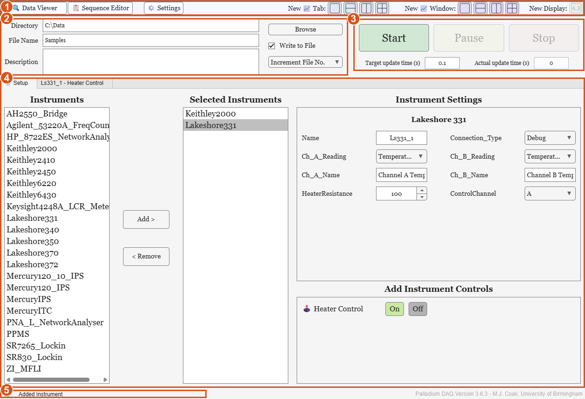
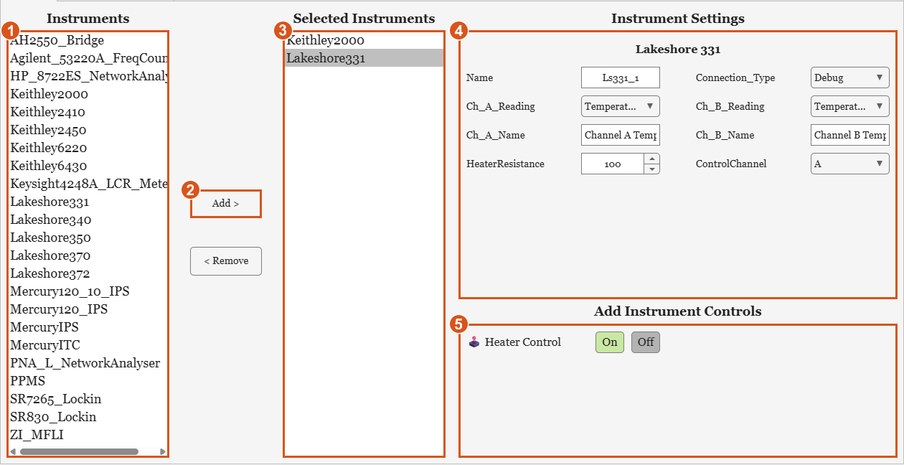
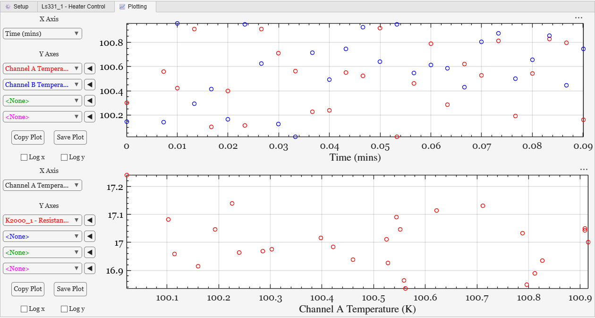
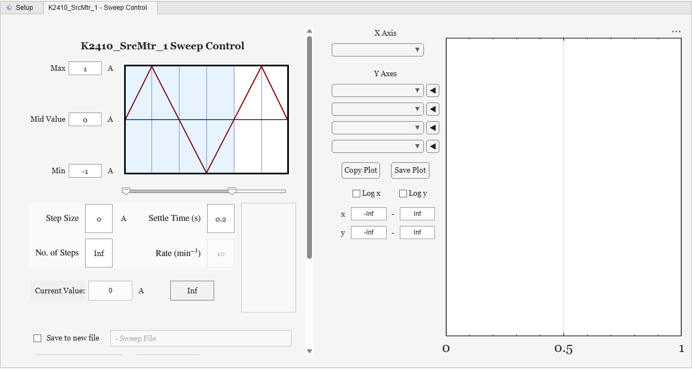

# GUI tour

The main window, **Palladium Data Acquisition**, has five parts, numbered in the picture and in the sections below: a toolbar, the data file settings, the measurement controls, a set of tabs, and a status bar.

## 1. Toolbar

* **🔍 Data Viewer** - opens the [Data Viewer](data-files.md), for browsing and plotting saved data files
* **📋 Sequence Editor** - opens the [Sequence Editor](sequences.md)
* **⚙️ Settings** - opens a small window with **Load Preset** and **Save Preset**, to load a [Preset](presets-and-config.md) or save the current setup as one
* **New 📈 Tab** - adds a tab of plots, in a 1x1, 2x1, 1x2 or 2x2 grid
* **New 📈 Window** - opens a separate window of plots, in the same grids - handy for a second monitor
* **New Display** - opens a *Big Number* window, showing one value in large type so it can be read across the lab. It is available once measurements have started, and asks which value to show

## 2. Data file

* **Directory** and **File Name** - where the data is saved. **Browse** picks both at once. `<DATE>` in the file name is replaced with today's date, as `yyyy-MM-dd`
* **Description** - a note written into the data file's header
* **Write to File** - untick to take measurements without saving them
* The write mode, for when a file of that name already exists:
  * **Increment File No.** - adds a number to the name (`-00001`, `-00002`, ...) so that each run has its own file
  * **Append To File** - adds the new data to the end of the existing file
  * **Overwrite File** - replaces it

See [Data files](data-files.md) for what is written.

## 3. Measurement controls

* **Start** - connects to the instruments, writes the data file's header, and starts taking measurements
* **Pause** / **Resume** - stops taking measurements without finishing the run
* **Stop** - ends the run
* **Target update time (s)** - how often to take a measurement. All the instruments are read once per measurement *tick*
* **Actual update time (s)** - the time the last tick actually took. If the instruments take longer to read than the target time, this is longer than the target

While measurements are running, the instrument list, instrument settings and data file settings are locked.

## 4. The tabs: Setup

The **⚙️ Setup** tab is where instruments are added and configured.

* **Instruments** (1) lists every instrument driver available: the built-in ones, your own MATLAB and Python instruments, sorted alphabetically. Press **Add >** (2), or double-click an instrument, to add it.
* **Selected Instruments** (3) lists the instruments added, by type. Each instrument is also given a **Name** - its default name plus a number, such as `K2000_1` - shown and editable in its Instrument Settings. The Name labels its data columns, is used in [sequences](sequences.md), and is the name of a variable in the MATLAB workspace holding the instrument, so it can be used from the Command Window. **< Remove** removes the selected instrument.
* **Instrument Settings** (4) shows the settings of the instrument selected in Selected Instruments. These are the instrument's *GUI-editable* properties (see the [API reference](reference/index.md)). The connection address fields shown depend on the **Connection_Type**: **Debug** simulates the instrument, with no hardware needed. Hover over a setting for its description.
* **Add Instrument Controls** (5) lists the Instrument Controls the selected instrument offers, such as a sweep or a heater control, with **On** and **Off** buttons. Turning one on adds a tab for it, named after the instrument and the control.

## Plotting tabs and windows

Each plot has:

* **X Axis** and up to four **Y Axes** - choose from the data columns. Each Y series has a **◀**/**▶** button to put it on the left or right y axis
* **Log x** and **Log y** - logarithmic axes
* Axis limit fields - leave them as **Inf** for automatic limits
* **Copy Plot** - copies the plot into a normal MATLAB figure, to edit or export
* **Save Plot** - saves the plot as `.fig` and `.png` files in the data directory

Time is shown in minutes from the start of the run. If there are no plots when measurements start, a **📈 Plotting** tab with two plots is added. Right-click a plotting tab's title to close it. The plot colours, markers, line styles, font size and legends are set in [Config.json](presets-and-config.md), and a [Preset](presets-and-config.md) can set up plots with their axes already chosen.

Instrument Control tabs, such as a sweep or heater control, appear between the Setup tab and the plotting tabs:

## 5. Status bar

The lamp and message at the bottom show what Palladium DAQ is doing: green when all is well, yellow while busy or for warnings, and red for errors. The version is shown at the bottom right.

When an error happens, a dialog asks whether to **Stop Measurements**, **Suppress Error** (carry on, and don't show this error message again), or **Ignore** it this time. In the MATLAB toolbox there is also **Stop & Go to Code**, which stops and opens the code where the error happened. Which messages reach the GUI, the Command Window and the log file is set in [Config.json](presets-and-config.md).

Closing the main window stops measurements, disconnects the instruments, and closes Palladium DAQ's other windows.
