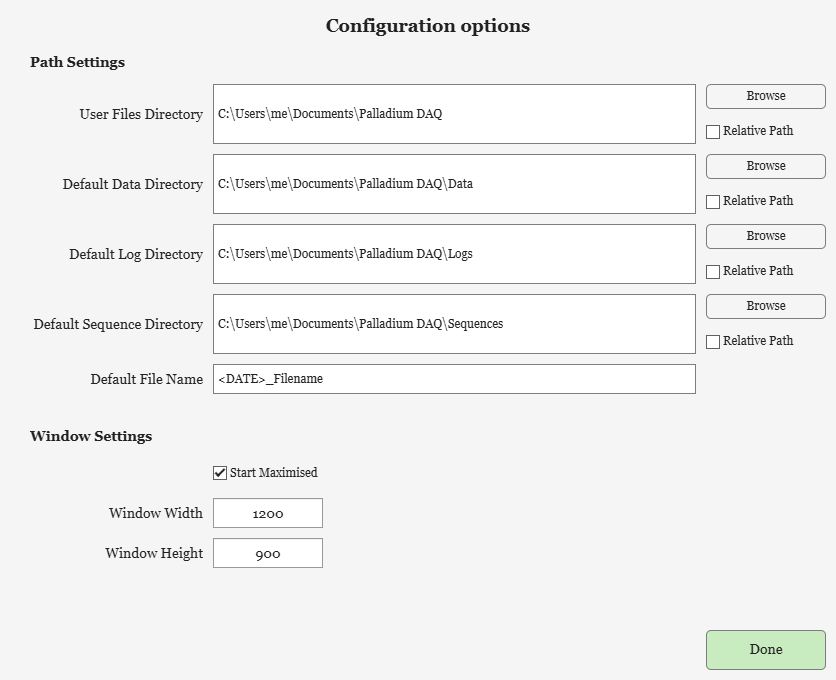

# Installation

Palladium DAQ comes in two forms:

* **MATLAB toolbox** - installed into MATLAB as an add-on. This is the usual choice: it can be scripted from MATLAB, extended with your own instrument drivers and presets, and includes this documentation in the Help browser.
* **Standalone application** - a compiled programme for computers without a MATLAB licence. It runs on the free MATLAB Runtime, and offers the built-in instruments and the GUI.

## MATLAB toolbox

### Requirements

* MATLAB R2026b or later
* Instrument Control Toolbox
* Python, only if you want to write [Python instruments](python-instruments.md)

### Installing

Either:

* In MATLAB, open the Add-On Explorer (**Home > Add-Ons > Explore Add-Ons**), search for **Palladium**, and click **Add**; or
* Download `PalladiumDAQ.mltbx` from the [latest release on GitHub](https://github.com/MattCoak-Research/PalladiumDAQ/releases/latest), and double-click it to install it in MATLAB.

The toolbox's **Getting Started** guide is in the Add-On Manager (**Home > Add-Ons > Manage Add-Ons**, then the toolbox's options), and this documentation is in the Help browser under **Supplemental Software**.

### Running

Type `Palladium` in the Command Window.

The first time Palladium DAQ runs, it asks for its basic settings in a **Config Entry** window: the default folders for data files, log files, sequences and your user files, the default data file name, and the window size. By default the folders are all in a `Palladium DAQ` folder in your Documents folder (on Windows, Mac and Linux): `Data`, `Logs` and `Sequences`, with the user files alongside them. Press **Done** to save them as `Config.json` in the installation folder.


 They can be changed later - see [Presets and Config.json](presets-and-config.md).

Optional settings are passed as name-value arguments:

| Argument | What it does |
| --- | --- |
| `Preset="Example"` | Applies a [Preset](presets-and-config.md) from your presets folder once Palladium DAQ has started |
| `View=[]` | Runs with no GUI, for scripted use |
| `ConfigFilePath="MyConfig.json"` | Uses a different [Config.json](presets-and-config.md), given relative to the Palladium DAQ installation folder |
| `DebugMode=true` | Stops on instrument errors with a full stack trace, instead of catching them - useful when writing drivers |

For example:

```matlab
pd = Palladium(Preset="Example"); 
```

### Updating and uninstalling

Install a new `.mltbx` over the old one to update. To uninstall, use the Add-On Manager. Your user files folder - presets, your own instruments - is not part of the toolbox, so it is kept.

## Standalone application

Download an installer from the [GitHub releases page](https://github.com/MattCoak-Research/PalladiumDAQ/releases) and run it. There are three versions, which differ only in how they get the MATLAB Runtime that the application needs:

| Installer | MATLAB Runtime |
| --- | --- |
| **Runtime Bundled** | Included in the installer - the largest download, but works offline |
| **Runtime Web Installer** | Downloaded during installation |
| **No Runtime** | Not included - install the matching MATLAB Runtime yourself first, from [MathWorks](https://www.mathworks.com/products/compiler/matlab-runtime.html) |

Launch Palladium DAQ from the shortcut the installer creates. On Windows the installation also includes `PalladiumDAQ_Debug.exe`, which opens a console window showing Palladium DAQ's messages - useful for diagnosing problems.

The standalone application cannot load instrument drivers or presets written as MATLAB code after it is built, and does not include this documentation.

## The user files folder

When Palladium DAQ first runs, it creates a folder called `Palladium DAQ - User Files` inside the user files folder chosen in the Config Entry window (`UserFilesDirectory` in [Config.json](presets-and-config.md)) - by default `Documents/Palladium DAQ/Palladium DAQ - User Files`. It holds:

| Folder | Contents |
| --- | --- |
| `Presets` | Your [Presets](presets-and-config.md). An `Example.json` is copied here to start from |
| `+Palladium\+Instruments` | Your own MATLAB [instrument drivers](writing-instruments.md). A copy of `TemplateInstrumentClass.m` is put here to start from |
| `PythonInstruments` | Your own [Python instruments](python-instruments.md) |
| `Instrument Drivers` | Third-party drivers some instruments need, such as the Quantum Design PPMS interface |

Files are only copied in if they are missing, so your own changes are never overwritten. The folder is added to the MATLAB path when Palladium DAQ starts.
