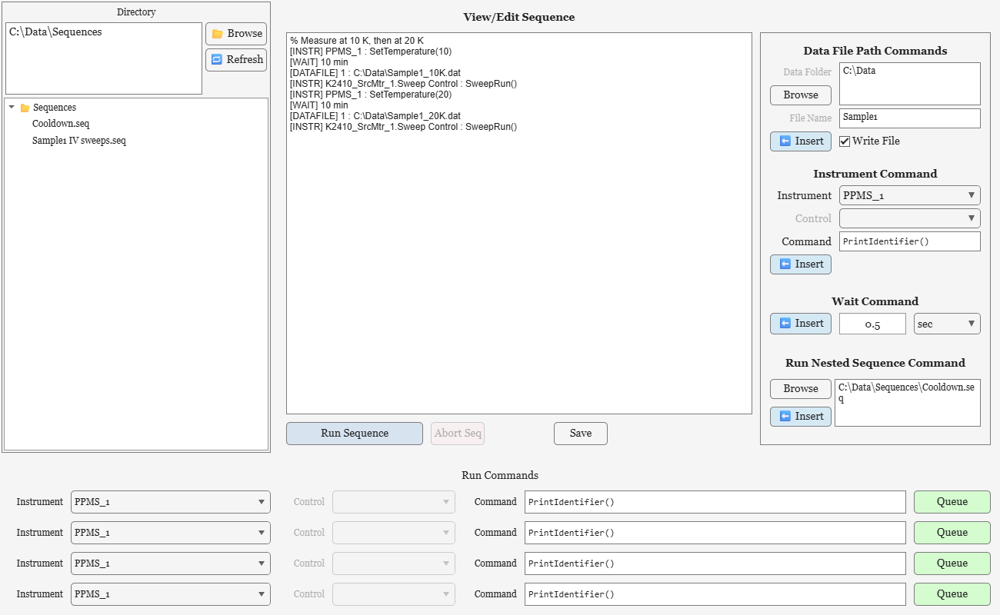

# Sequences

A sequence is a list of commands that Palladium DAQ works through on its own while it measures - for example, setting a temperature, waiting for it to settle, switching to a new data file and starting a sweep. Sequences let a whole measurement run continue overnight without anyone at the controls.

## The Sequence Editor

Open the editor with the **📋 Sequence Editor** button in the main window.



It has three areas:

* **Directory** (left) - a folder tree of saved sequence files. **📂 Browse** chooses the folder and **🔁 Refresh** updates the list. Click a file to load it.
* **View/Edit Sequence** (centre) - the sequence itself, as text you can edit directly. **Save** saves it, **Run Sequence** queues it to run, and **Abort Sequence** stops it.
* **Commands** (right) - forms that build a command line for you and add it to the end of the sequence with their **⬅️ Insert** buttons: a Wait command, an Instrument command, a Data File command and a Run Nested Sequence command.

The **Run Commands** rows send a single command straight away instead: choose an Instrument (and optionally one of its Controls), type or pick a Command, and press **Queue**. The button shows **Executing..** until the command has finished.

In the Command fields, right-click to choose from the instrument's (or control's) available methods - selecting one fills in its name and arguments.

## Sequence files

Sequences are plain text files with the extension `.seq`, saved by default in the sequences folder set by `DefaultSequenceDirectory` in [Config.json](presets-and-config.md). The first two lines are a header written by the editor; after that there is one command per line. Blank lines are ignored, and lines starting with `%` are comments.

Each command line starts with its type in square brackets:

| Command | Example | What it does |
| --- | --- | --- |
| `[WAIT]` | `[WAIT] 30 sec` | Waits for a time, given in `sec`, `min` or `hr` |
| `[INSTR]` | `[INSTR] K2000_1 : PrintIdentifier()` | Calls a method of an instrument, by the instrument's Name |
| `[INSTR]` (control) | `[INSTR] K2410_SrcMtr_1.Sweep Control : SweepRun()` | Calls a method of one of an instrument's Instrument Controls |
| `[DATAFILE]` | `[DATAFILE] 1 : C:\Data\Run2.dat` | Starts writing to a new data file |
| `[DATAFILE]` (stop) | `[DATAFILE] 0` | Stops writing data to file - see Data file commands, below |
| `[DATAFILE]` (resume) | `[DATAFILE] 1` | Starts writing to file again, with the current file name - see Data file commands, below |
| `[RUN]` | `[RUN] C:\Sequences\Cooldown.seq` | Runs another sequence file at this point |

A complete sequence might look like this:

```text
Palladium Sequence File, Version [1.0]

% Measure at 10 K, then at 20 K
[INSTR] PPMS_1 : SetTemperature(10)
[WAIT] 10 min
[DATAFILE] 1 : C:\Data\Sample1_10K.dat
[INSTR] K2410_SrcMtr_1.Sweep Control : SweepRun()
[INSTR] PPMS_1 : SetTemperature(20)
[WAIT] 10 min
[DATAFILE] 1 : C:\Data\Sample1_20K.dat
[INSTR] K2410_SrcMtr_1.Sweep Control : SweepRun()
```

### Data file commands

`[DATAFILE]` switches writing to file on or off while measurements run - for example to give each stage of a sequence its own data file. It starts with `1` (write to file) or `0` (stop writing), and `true` and `false` also work:

| Command | What it does |
| --- | --- |
| `[DATAFILE] 1 : C:\Data\Run2.dat` | Starts writing to a new data file, `C:\Data\Run2.dat` |
| `[DATAFILE] 0` | Stops writing to file. Measurements carry on, and the plots still update, but no data is saved |
| `[DATAFILE] 1` | **With no file name: starts writing to file again, using the current file name** (shown in the main window's File Name box) |

The last form is easy to miss: leave the file name out to switch writing back on - after a `[DATAFILE] 0`, or after starting measurements with **Write to File** unticked - without choosing a new name. Leaving the file name empty in the Sequence Editor's Data File command form does the same.

Whenever writing starts, the new file begins with the usual [header](data-files.md), with the instruments' settings at that moment. The **file write mode** set in the main window still applies:

* **Increment File No.** (the default) - a new numbered file is started, such as `Run2-00002.dat`, so earlier data is never overwritten. This includes `[DATAFILE] 1` with no file name, which starts the next numbered file
* **Append To File** - data is added to the end of the file if it already exists, without a second header
* **Overwrite File** - an existing file of that name is replaced. Take care: `[DATAFILE] 1` naming the file currently being written, or with no file name, replaces that file

### Instrument commands

An instrument command names the instrument by its **Name**, shown in its Instrument Settings. When an instrument is added it is named from its default name plus a number, such as `K2000_1` for the first Keithley 2000 or `K2410_SrcMtr_1` for a Keithley 2410, unless you rename it. The instrument must already be added when the sequence runs. The method can be any public method of the instrument - right-click the Command field to see them. Arguments can be numbers, `true` or `false`, or text (written without quotes). Spaces are removed from commands, so text arguments cannot contain spaces.

## How a sequence runs

Commands are carried out by the measurement loop, one step per measurement tick - so **measurements must be running** (press **Start**) for a sequence to progress. Data is recorded throughout, as usual.

Each command runs when the previous one has finished. Most instrument commands finish straight away, but some wait until the instrument reports it is done, holding up the rest of the sequence until then:

* PPMS `SetTemperature(...)` and `SetField(...)` wait until the temperature or field is stable
* An Instrument Control's `SweepRun()` waits until the sweep is complete

`[RUN]` commands are expanded when the sequence starts, so a nested sequence's commands run in its place. When the last command finishes, the Run Sequence button is enabled again. **Abort Sequence** clears the remaining commands and stops the one that is running.

## From a script

To queue a single instrument command from a script, use `CacheInstrumentCommand` on the Palladium object:

```matlab
pd = Palladium();
k = pd.AddInstrument("Keithley2410", ConnectionType="Debug");
pd.CacheInstrumentCommand(k, "SetSourceLevel(0.001,true)");
pd.Start(); 
```
