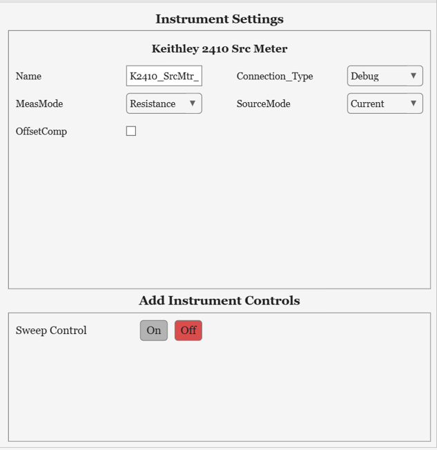

# Writing an instrument driver

Each kind of instrument Palladium DAQ can read is a MATLAB class - an *instrument driver* - that inherits from [`Palladium.Core.Instrument`](reference/Palladium.Core.Instrument.md). The base class does the common work: connecting over GPIB, serial, Ethernet, USB or VISA, sending commands, simulating the instrument, and showing settings in the GUI. A driver adds what is specific to its instrument: which readings it takes, and the commands to take them.

The [Keithley2000](reference/Palladium.Instruments.Keithley2000.md) (a multimeter) and [Lakeshore331](reference/Palladium.Instruments.Lakeshore331.md) (a temperature controller, with a heater control) drivers are good, fully commented examples to read alongside this page.

## Where drivers go

Put your own drivers in the `+Palladium\+Instruments` folder of your [user files folder](installation.md). Palladium DAQ finds them when it starts, and lists them in the Instruments list with the built-in drivers. A driver's class name must not be the same as a built-in driver's.

A copy of `TemplateInstrumentClass.m` is put in that folder to start from: copy it, and rename the file and the class (they must match) to your instrument's name, such as `Agilent34401A`.

## The parts of a driver

A driver must:

* Set three properties: `FullName`, a descriptive name shown in the GUI; `Name`, a short name, used to name the instrument and its data columns; and `Connection_Type`, the default connection
* Implement two methods: `GetHeaders`, which returns the names and units of its data columns, and `Measure`, which returns one reading for each of them

```matlab
classdef Agilent34401A < Palladium.Core.Instrument
    %Agilent34401A - Instrument driver for the Agilent 34401A digital multimeter.

    %% Properties (Public)
    properties(Access = public)
        FullName = "Agilent 34401A DMM";                        %Full name, displayed in the GUI
    end

    %% Properties (Public, Set Observable)
    properties(Access = public, SetObservable)
        Name = "A34401";                                        %Instrument name, used as the prefix of its data column headers
        Connection_Type = Palladium.Enums.ConnectionType.GPIB;  %Type of connection to use to communicate with the instrument
    end

    %% Constructor
    methods
        function this = Agilent34401A()
            %Set the supported connection types and default connection settings

            this.DefineSupportedConnectionTypes(["Debug", "GPIB", "Serial"]);
            this.GPIB_Address = 22;
        end
    end

    %% Methods (Public)
    methods (Access = public)
        function [Headers, Units] = GetHeaders(this)
            %Data column header and units for the reading returned by Measure

            Headers = this.Name + " - Voltage_V";
            Units = "V";
        end

        function dataRow = Measure(this)
            %Take and return one DC voltage reading, in V

            if this.SimulationMode
                dataRow = this.GenerateSimulatedData(1, Baseline=1.5, Variance=0.01);
                return;
            end
            dataRow = this.QueryDouble("MEAS:VOLT:DC?");
        end
    end
end 
```

`Measure` must return exactly as many values as `GetHeaders` returns headers, in the same order. It is called once per measurement tick, so it should be quick.

Follow the [Code and comment conventions](developers/code-conventions.md) for the layout of the class and its comments - the [API reference](reference/index.md) is generated from them.

### The constructor

The constructor sets the driver's defaults. It must work with no arguments and with no hardware connected: connecting happens later, when measurements start. In it:

* `DefineSupportedConnectionTypes` lists the connections the instrument supports, from `Debug`, `GPIB`, `Ethernet`, `Serial`, `USB` and `VISA` (always include `Debug`)
* Set default addresses, such as `GPIB_Address`, and connection settings in `this.ConnectionSettings`:

| Setting | Default | Used for |
| --- | --- | --- |
| `GPIB_BoardIndex` | 0 | GPIB |
| `GPIB_Terminators` | `["CR/LF", "CR/LF"]` | GPIB read and write terminators |
| `GPIB_Timeout` | 10 | GPIB timeout, in seconds |
| `Port` | 5025 | Ethernet (TCP/IP) port |
| `SerialSettings` | 9600 baud, 8 data bits, no parity, 2 stop bits, `LF` terminator | Serial. Set it as a whole struct, with fields `BaudRate`, `DataBits`, `Parity`, `StopBits` and `Terminator` |

* Set defaults for categorical settings (see below)
* Offer Instrument Controls with `DefineInstrumentControl` (see below)

### Talking to the instrument

Use the base class's methods to send commands; they are simulated automatically in Debug mode:

| Method | What it does |
| --- | --- |
| `this.WriteCommand(cmd)` | Sends a command |
| `this.QueryDouble(cmd)` | Sends a query and returns the reply as a number |
| `this.QueryString(cmd)` | Sends a query and returns the reply as text |
| `this.ReadString()` | Reads a reply |

### Simulation

With `Connection_Type` set to `Debug`, the driver runs in simulation mode (`this.SimulationMode` is `true`), so it can be developed and tested without the hardware. The query methods return made-up values, but `Measure` should return realistic ones: check `this.SimulationMode` and return simulated data, as above. `GenerateSimulatedData(numRows, numCols, Baseline=..., Variance=...)` gives random values scattered around a baseline. To simulate an instrument's state, store values in `this.SimulatedData` when they are set, and read them back with `this.RetrieveSimulatedDataValue(name, defaultValue)`.

### Settings in the GUI

Public properties in a `SetObservable` properties block appear in the Instrument Settings panel, where they can be changed, and are saved in [Presets](presets-and-config.md). Use them for settings a user should choose, such as a channel name.

For a setting with a fixed list of options, use a *categorical*: add a one-line converter in a `Categoricals` methods block, and set a default in the constructor. The GUI then shows a drop-down:

```matlab
%% Categoricals
methods
    function catOut = RangeType(this, inputStr); catOut = this.ConvertToCategorical(inputStr, ["Auto", "1 V", "10 V"]); end
end
% ...and in the constructor:
this.Range = this.RangeType("Auto"); 
```

To hide settings that don't apply to your instrument, override `GetPropertiesToIgnore` (a protected method) to return their names. The address settings that don't match the chosen connection type are hidden automatically.

### Recording the setup

Override `CollectMetaData` to record settings that don't change during a run - ranges, integration times, modes - in the [data file's header](data-files.md). It returns a struct; each field becomes a `Setting = value` pair.

### Connecting and closing

To set the instrument up when measurements start - for example to read back its configuration - override `Connect`, call the base class's version first, and then send your commands (skipping them in simulation mode). Override `Close` to put the instrument back in its normal state before disconnecting. The Keithley2000 driver does both.

## Instrument Controls

Instrument Controls add a tab with extra logic and controls for an instrument, such as a sweep. Offer one in the constructor:

```matlab
this.DefineInstrumentControl(Name = "Sweep Control", ClassName = "SweepController_Stepped", TabName = "Sweep Control", EnabledByDefault = false); 
```

`EnabledByDefault = true` turns the control on as soon as the instrument is added. The control appears as an On/Off option under Add Instrument Controls:


 Each control needs the driver to implement some methods:

| Control (`ClassName`) | What it does | Methods the driver must implement |
| --- | --- | --- |
| `SweepController_Stepped` | Steps an output (such as a source voltage) through a range, waiting to settle at each step | `SetNewSweepStepValue(value)`, `GetSweepUnitsString()` |
| `SweepController_Ramp` | Ramps an output (such as a magnet's field) to each target, and waits until it gets there | `SetRampingToTarget(target, rate, settings)`, `AbortRamp()`, `CheckRampStatus(...)`, `GetSweepUnitsString()` |
| `ScanController` | Runs a slow measurement, such as a network analyser scan, over many ticks and saves each scan to its own file | `RunScan()`, `CheckScanComplete()`, `GetCompletedScanData()`, `GetScanHeaders()` |
| `LakeshoreHeaterControl` | Setpoint, ramp, PID and heater panel for Lake Shore temperature controllers | `CollectHeaterControlSettings()`, and `ApplySettings` (below) |
| `MagnetController` | Control panel for magnet power supplies | `SetState_Hold()`, `SetState_RampToZero()`, `SetState_RampToSetPoint()`, `SetRampRate_TeslaMin(rate)`, `SetTargetField(field)`, `GatherStatusStructForControlPanel()` |

See the drivers that use each control for examples - Keithley2410 for the stepped sweep, MercuryIPS for ramps and the magnet controller, HP_8722ES_NetworkAnalyser for scans, and Lakeshore331 for the heater control.

Controls send settings to the instrument with its `SettingsInput` method. The settings are stored, and applied at the start of the next measurement tick by calling the driver's protected `ApplySettings(settings)` method - so all communication with the instrument happens from the measurement loop, in order.

For a [Sequence](sequences.md) to wait for a slow command - such as setting a temperature - to finish, register a function that reports when it is done, in the constructor: `this.RegisterCommandCompleteQuery("SetTemperature", @this.IsTemperatureStable)`. The PPMS driver does this.

## Testing a driver

* Add the instrument with `Connection_Type` set to `Debug` and start measuring, to check its headers, readings and settings without hardware.
* Start Palladium DAQ with `Palladium(DebugMode=true)` while developing: instrument errors then stop with a full stack trace, instead of being caught and logged.
* Write unit tests: see `Tests/Unit Tests/Instruments/test_Keithley2000.m` in the [source repository](developers/index.md), which checks the constructor's defaults, the headers for each measurement mode, and a simulated measurement.
* Try it with the real instrument - Palladium DAQ's simulation can't check the commands themselves.

To contribute a driver to Palladium DAQ, so it is built in for everyone, see [Developers](developers/index.md).
